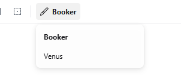

<div align="center">
<h1>FluxDS</h1>
<p><em>Multi-theme design system/component library featuring a Figma design token to CSS pipeline</em></p>

<div>
<a href="https://github.com/AFOJ/FluxDS/issues/new?title=[Bug]+">Report a bug</a> · 
<a href="https://github.com/AFOJ/FluxDS/issues/new?title=[Feature]+">Submit a feature request</a>
</br></br>
</div>

<div>
  <a href="https://preactjs.com/">
    
  </a>
  <a href="https://tailwindcss.com/">
    
  </a>
  <a href="https://www.figma.com/">
    
  </a>
  <a href="https://storybook.js.org/">
    
  </a>
  <a href="https://www.typescriptlang.org/">
    
  </a>
</div>
</div>

## Overview

### What is FluxDS?

This system bridges the gap between Figma and CSS, making multi-theme design tokens easy to manage. It converts tokens directly into CSS variables while keeping the original Figma naming conventions for a better developer experience. These variables are then applied to components via Tailwind’s arbitrary values. To ensure a solid user experience, all components include built-in accessibility features like focus trapping and keyboard navigation.

### What happens when the design token JSON gets updated?

The system is built to stay in sync with design changes with minimal manual effort. When updates are made in Figma, you simply run the extraction command (`npm run build:design-tokens`) to refresh the token set. The script traverses the JSON structure, resolves all cross-references and aliases, and outputs a clean set of CSS variables. This ensures that any changes to theme colours, spacing, or typography are automatically reflected across all components simultaneously.

## What about themes in the design system I don't want in the generated CSS?

The token to css script is designed to be selective about which data it processes. The script only looks at top-level objects that follow the `Mapped/` pattern and validates them against the metadata order in your configuration. To exclude a specific theme or an experimental one from the final bundle, you only need to remove its key from the `tokenSetOrder` array within the JSON file. This allows you to maintain a large design file while only exporting the specific themes that are ready for production.

```json
"$metadata": {
    "tokenSetOrder": [
      "global",
      "Primitives/Default",
      "Alias colours/booker",
      "Alias colours/venus",
      "Mapped/venus",
      "Responsive/Desktop",
      "Responsive/Mobile"
    ]
  }
```

<em>With the example above, `Mapped/booker` will not be considered when processing the JSON even if it is in the actual structure.</em>

## Getting started

Clone the repo:

```bash
git clone https://github.com/AFOJ/FluxDS.git
```

Change to the project directory:

```bash
cd FluxDS
```

Install dependencies:

```bash
npm install
```

Run Storybook:

```bash
npm run storybook
```

Then visit http://localhost:6006/

Build Storybook:

```bash
npm run storybook:build
```

## Themes

### Switching Themes

#### In App

To apply a theme to an area, add the `data-theme={your-target-theme}` attribute to a wrapper element.

```jsx
<div data-theme="booker">
  <Button>Scoped to the theme "Booker"</Button>

  <div data-theme="venus">
    <Button>Scoped to the theme "Venus"</Button>
  </div>
</div>
```

#### In Storybook

Use the "Themes" (paintbrush icon) in the toolbar to switch themes globally.



### Generating Theme variables

To generate new theme variables:

```bash
npm run build:design-tokens
```

Then copy the content of the generated CSS in `scripts/token-extractor/tokens.css` into `src/global.css`.

### Token Extractor

The design-token pipeline lives in `scripts/token-extractor`. It exposes a reusable `FigmaTokenExtractor` class, a small CLI wrapper, and Jest coverage for the conversion rules.

For the full extractor API, conversion rules, and test notes, see [`scripts/token-extractor/README.md`](scripts/token-extractor/README.md).
